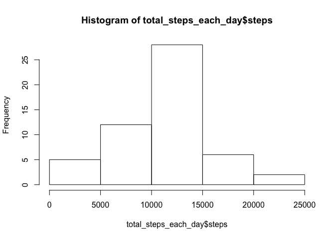
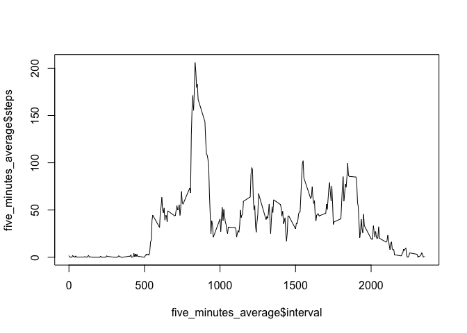
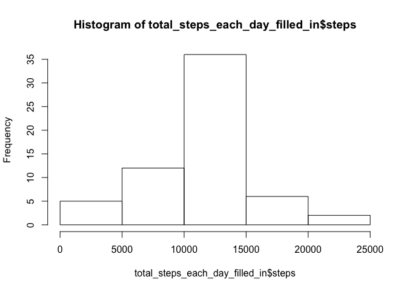
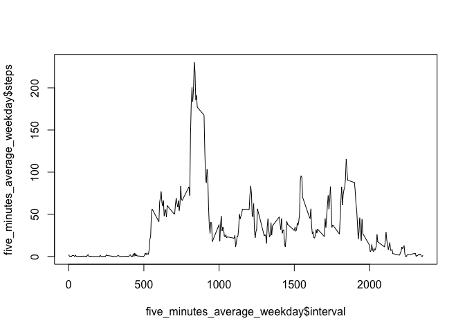
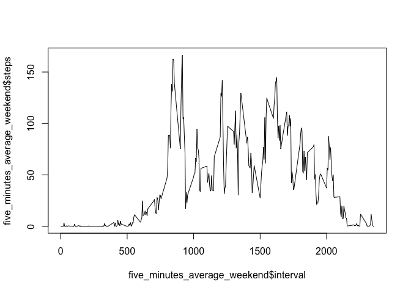

# Reproducible Research: Peer Assessment 1


## Loading and preprocessing the data

```r
## Load necceary library
library(lubridate)
```

```
## 
## Attaching package: 'lubridate'
```

```
## The following object is masked from 'package:base':
## 
##     date
```

```r
library(psych)

data <- read.csv('data/activity.csv')
dim(data)
```

```
## [1] 17568     3
```


## What is mean total number of steps taken per day?

```r
total_of_steps_per_day <- sum(data$steps, na.rm = TRUE)
total_of_steps_per_day
```

```
## [1] 570608
```

```r
## Calculating the total number of steps taken each day and stored in a variable
total_steps_each_day <- aggregate(steps~date, data=data, FUN=sum, na.rm=TRUE)

## Generating the Histogram by each day
hist(total_steps_each_day$steps)
```

<!-- -->

```r
total_steps_each_day_mean <- mean(total_steps_each_day$steps)
total_steps_each_day_median <- median(total_steps_each_day$steps)

## Mean
total_steps_each_day_mean
```

```
## [1] 10766.19
```

```r
## Median
total_steps_each_day_median
```

```
## [1] 10765
```


## What is the average daily activity pattern?

```r
five_minutes_average <- aggregate(steps~interval, data=data, FUN=mean, na.rm=TRUE)
plot(x = five_minutes_average$interval, y = five_minutes_average$steps, type = "l") 
```

<!-- -->

```r
## Max steps
max_steps <- max(five_minutes_average$steps)

for (i in 1:288) 
{
    if (five_minutes_average$steps[i] == max_steps)
        five_minute_interval_at_max_steps <- five_minutes_average$interval[i]
}
five_minute_interval_at_max_steps 
```

```
## [1] 835
```


## Imputing missing values

```r
total_na <- 0
for (i in 1:17568)
{
    if(is.na(data$steps[i])) 
        total_na <- total_na+1 
}
total_na
```

```
## [1] 2304
```

```r
activity_filled_in <- data
# loop to find the na
for (i in 1:17568) 
{
    if(is.na(activity_filled_in$steps[i]))
    { 
        five_minute_pointer <- activity_filled_in$interval[i] 
        for (j in 1:288) 
        {
            if (five_minutes_average$interval[j] == five_minute_pointer)
                activity_filled_in$steps[i] <- five_minutes_average$steps[j]
        }
    }
}

## Calculating the total number of steps taken each day and stored in a variable
total_steps_each_day_filled_in <- aggregate(steps~date, data=activity_filled_in, FUN=sum, na.rm=TRUE)

## Generating the Histogram by each day with new dataset (activity_filled_in)
hist(total_steps_each_day_filled_in$steps)
```

<!-- -->

```r
## funtion mean and median
total_steps_each_day_mean_filled_in <- mean(total_steps_each_day_filled_in$steps)
total_steps_each_day_median_filled_in <- median(total_steps_each_day_filled_in$steps)

## Mean
total_steps_each_day_mean_filled_in
```

```
## [1] 10766.19
```

```r
## Median
total_steps_each_day_median_filled_in
```

```
## [1] 10766.19
```


## Are there differences in activity patterns between weekdays and weekends?

```r
### creating a char vector (week_day) 
week <- wday(activity_filled_in$date)
week_day <- week
for (i in 1:17568) # loop to find the na
{
    if(week[i] == 1)
        week_day[i] <- 'weekend'
    if(week[i] == 2)
        week_day[i] <- 'weekday'
    if(week[i] == 3)
        week_day[i] <- 'weekday'
    if(week[i] == 4)
        week_day[i] <- 'weekday'
    if(week[i] == 5)
        week_day[i] <- 'weekday'
    if(week[i] == 6)
        week_day[i] <- 'weekday'
    if(week[i] == 7)
        week_day[i] <- 'weekend'
}

### Creating a new factor variable in the dataset "activity_filled_in" 
activity_filled_in$weekday <- week_day

# finding the elements by "weekday" or "weekend"
weekday <- grep("weekday",activity_filled_in$weekday)
weekday_frame <- activity_filled_in[weekday,]
weekend_frame <- activity_filled_in[-weekday,]

five_minutes_average_weekday <- aggregate(steps~interval, data=weekday_frame, FUN=mean, na.rm=TRUE)
five_minutes_average_weekend <- aggregate(steps~interval, data=weekend_frame, FUN=mean, na.rm=TRUE)

plot(x = five_minutes_average_weekday$interval, y = five_minutes_average_weekday$steps, type = "l") 
```

<!-- -->

```r
plot(x = five_minutes_average_weekend$interval, y = five_minutes_average_weekend$steps, type = "l") 
```

<!-- -->

